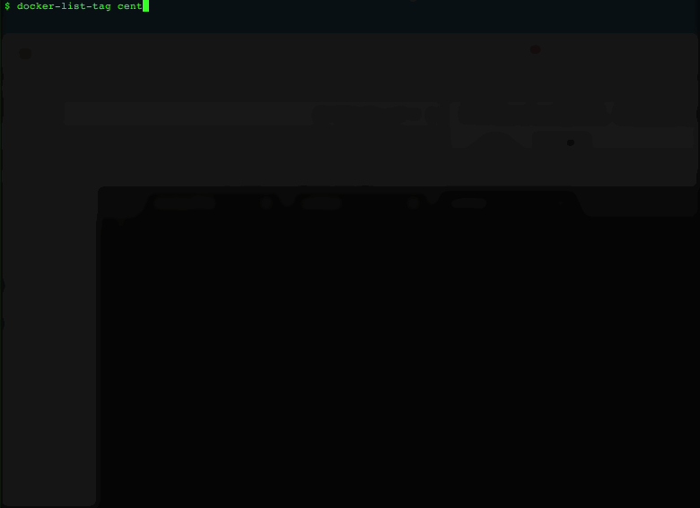

# Listing Docker Image Tag
List up docker image tags from docker-hub API.

## Abstract
You can search docker image tag by using below command.

      $ curl https://registry.hub.docker.com//repositories/<image-name>/tags

But response is JSON and it it not easy to parse JSON by one-liner in CLI.

So, I wrote a trivial script by Go lang.

(I hope this function implemented to original docker command.)

## Usage
First, download source code.

      $ git clone https://github.com/stqp/docker-list-tag.git

Build and install.

      $ go build
      $ go install

Then, you can use.

      $ docker-list-tag centos

## Prerequisite

You need $GOPATH. If you have not set yet, see [SettingGOPATH](https://github.com/ang/go/wiki/SettingGOPATH).

Edit `~/.bashrc` like this.

      export GOPATH=$HOME/go
      export GOBIN=$HOME/go/bin
      export PATH="$GOBIN:$PATH"

Then reload.

      $ source ~/.bashrc

